# Construindo um portal de Gerenciamento Multi-Instância para InterSystems IRIS

## Introdução

O Management Portal do InterSystems IRIS administra uma instância por vez. Equipes responsáveis por vários servidores independentes precisam de uma visão única para pesquisar processos, comparar configurações, monitorar ambientes, executar SQL somente leitura e aplicar alterações controladas.

O IRIS Multi-Manager atende esse fluxo. O portal web conecta-se a uma frota configurada de instâncias IRIS e preserva a origem em cada resultado. A aplicação responde a quatro perguntas operacionais:

- Em qual instância existe um processo ou recurso?
- Em quais instâncias ele está ausente?
- Quais configurações são diferentes?
- Qual foi o resultado e a duração em cada servidor selecionado?

A implementação combina a SysAdmin API do IRIS, o driver InterSystems JDBC, metadados do dicionário de classes, procedimentos SQL em ObjectScript, Embedded Python, `VECTOR`, `EMBEDDING` e índices HNSW. O Angular fornece o workspace. O Quarkus cuida da autenticação, da execução paralela limitada, da validação, da normalização e dos resultados por destino.

## O que a aplicação faz

O workspace contém onze áreas:

| Área | Comportamento implementado |
| --- | --- |
| Instances | Conecta de forma independente às instâncias IRIS registradas e mantém credenciais em uma sessão do backend |
| Overview | Exibe saúde, uptime, processos, sessões CSP, desempenho, licenciamento, alertas e tendências curtas em memória |
| Processes | Pesquisa na frota, qualifica cada resultado por instância e permite suspender, retomar e terminar processos após confirmação |
| Licenses | Compara limites, uso atual e máximo, usuários e processos |
| System | Exibe contadores acumulados do sistema e alocação de memória compartilhada |
| Web Apps | Compara presença e configuração e aplica alterações suportadas após preflight |
| Tasks | Compara tarefas agendadas e apresenta uma prévia de execução, suspensão ou retomada |
| Permissions | Compara usuários, papéis, recursos, coleções de wallet, credenciais X509 e metadados OAuth |
| Events | Lê eventos de auditoria por instância |
| Fleet Query | Executa um `SELECT` único, limitado e somente leitura nas instâncias selecionadas |
| Vector Search | Descobre ativos vetoriais, configurações de embedding, localizações de storage, capacidades do Embedded Python, linhas de origem e índices HNSW |

As operações enviadas ao `FleetExecutor` retornam um resultado por destino selecionado. A validação da requisição e das credenciais pode rejeitar uma chamada antes dessa etapa. Após o início da execução, uma falha de destino preserva os resultados bem-sucedidos. As alterações são efetivadas de forma independente em cada instância; uma alteração aplicada permanece quando outro destino falha.

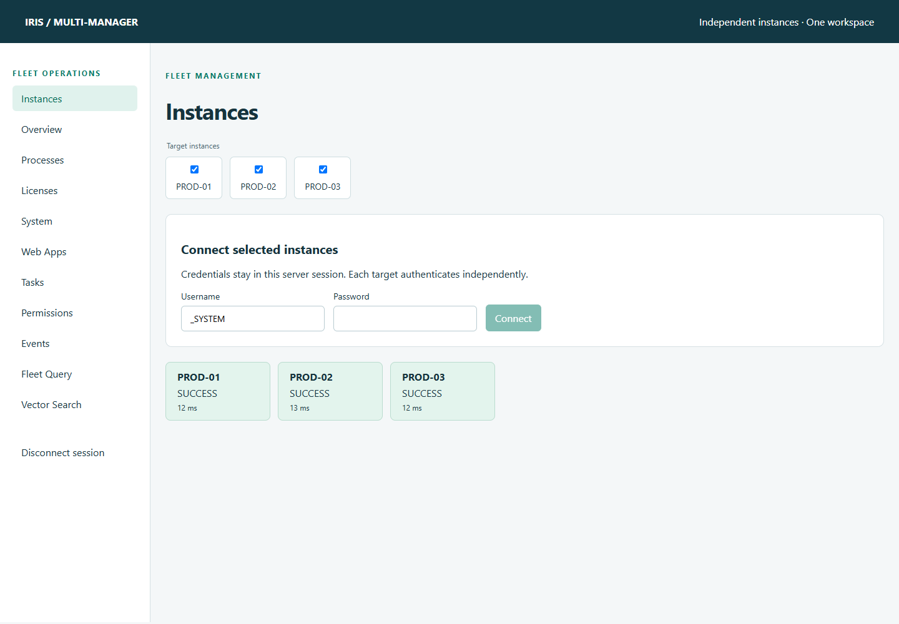

## Arquitetura

O sistema possui uma camada de navegador, uma camada de orquestração e destinos IRIS independentes.

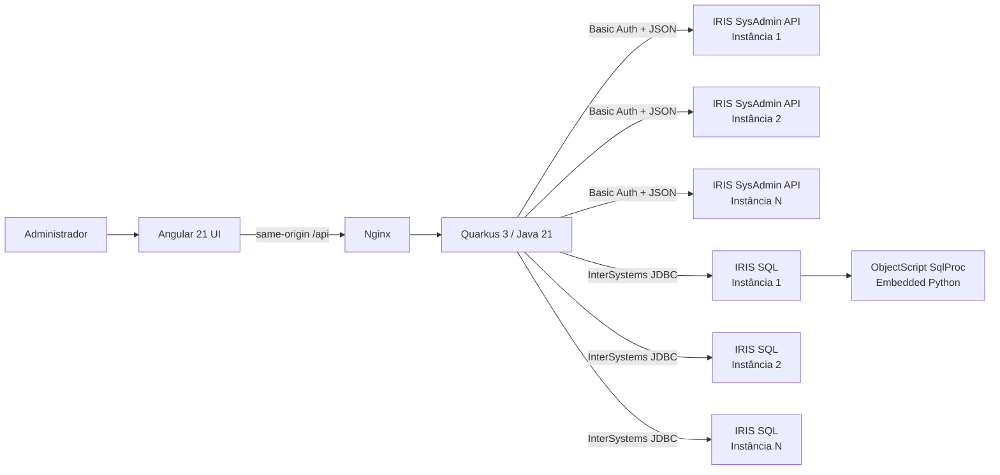

O frontend não chama os servidores IRIS gerenciados diretamente. O Nginx entrega o Angular e encaminha `/api/` para o Quarkus. O backend centraliza o registro de instâncias, as credenciais, os destinos de saída, os timeouts, os limites de resposta e as regras de mutação.

As duas formas de integração com IRIS têm responsabilidades distintas:

1. **SysAdmin API** fornece recursos administrativos, monitoramento, metadados de segurança, tarefas, processos, namespaces e mappings.
2. **JDBC** executa SQL limitado, consulta o dicionário de classes e `%Embedding.Config`, pré-visualiza linhas, executa DDL de HNSW e chama procedimentos SQL controlados.

O proxy da API em [frontend/nginx.conf](frontend/nginx.conf) preserva o caminho da requisição:

```nginx
location /api/ {
    proxy_pass http://backend:8080;
    proxy_set_header Host $host;
    proxy_set_header X-Forwarded-Proto $scheme;
    proxy_read_timeout 65s;
    client_max_body_size 64k;
}
```

O navegador acessa a porta `8080` do host. O Nginx alcança `backend:8080` dentro da rede Compose; a porta `8081` do host permite acesso direto ao backend. Nessa rede, os destinos IRIS usam nomes de serviço como `iris-prod1`, porta web `52773` e porta JDBC `1972`. O registro de instâncias usa esses endereços internos, independentemente das portas publicadas no host.

## Estrutura do repositório

```text
IRIS-multi-manager/
├── frontend/                  Componentes standalone Angular e configuração do Nginx
├── backend/                   API REST Quarkus, orquestração, validação e testes
├── docker/iris/               Imagem IRIS, classes ObjectScript, rotinas e seed
├── scripts/                   Smoke tests PowerShell de ponta a ponta
├── spec/                      Especificações do produto e do gerenciamento vetorial
├── docs/screenshots/          Capturas usadas pelo README e por este artigo
└── docker-compose.yml         Topologia demo local com cinco serviços
```

As responsabilidades específicas do IRIS permanecem separadas no código. Os clientes HTTP ficam em `sysadmin`, o código JDBC e do dicionário em `query` e `vector`, o comportamento de frota em `fleet` e os modelos normalizados em seus próprios pacotes.

## Bibliotecas e tecnologias de execução

| Camada | Tecnologia | Papel no projeto |
| --- | --- | --- |
| IRIS | InterSystems IRIS Community 2026.2 | Plataforma de dados gerenciada e runtime das três instâncias demo |
| Código IRIS | Classes e rotinas ObjectScript | Persistência demo, tarefas, processo worker, procedimentos SQL e extensão vetorial |
| Python no IRIS | Embedded Python | Geração vetorial determinística e verificação de módulos Python |
| IRIS SQL | `VECTOR`, `EMBEDDING`, `%Embedding.Config`, HNSW | Demonstração de ativos vetoriais e embeddings |
| Backend Java | Java 21 | Records, integração HTTP/JDBC, concorrência e validação |
| Framework REST | Quarkus 3.27.5.1 / Jakarta REST | Recursos REST, injeção de dependência, validação e health endpoints |
| JSON | Jackson | Leitura de payloads SysAdmin, respostas normalizadas e projeção segura de campos |
| Acesso ao banco | InterSystems JDBC 3.11.0 | Fleet Query, descoberta no dicionário, ações vetoriais e chamadas SqlProc |
| Frontend | Angular 21.2, TypeScript 5.9 | Componentes standalone, signals, modelos tipados e formulários |
| Servidor web | Nginx 1.28 | Entrega do Angular e proxy de mesma origem para a API |
| Testes | JUnit 5 e scripts PowerShell | Testes de segurança em unidade e validação do ambiente multi-container |
| Empacotamento | Docker Compose | Frontend, backend e três instâncias IRIS reproduzíveis |

As versões vêm de [backend/pom.xml](backend/pom.xml), [frontend/package.json](frontend/package.json) e dos Dockerfiles. RxJS 7.8 e REST Assured são dependências declaradas; a aplicação atual usa `fetch` e signals, e os testes usam JUnit e PowerShell. O Quarkus fornece endpoints Jakarta REST, injeção de dependência, serialização JSON com Jackson, validação, suporte a OpenAPI e endpoints de saúde do SmallRye.

## A modelagem central: todo resultado pertence a uma instância

Uma resposta de frota contém um `FleetTargetResult<T>` para cada destino:

```java
public record FleetTargetResult<T>(
    String instanceId,
    String instanceName,
    String status,
    int httpStatus,
    long elapsedMs,
    T data,
    String errorCode,
    String message) {}
```

O agregado registra destinos solicitados e concluídos, além dos totais de sucesso e falha:

```java
public record FleetResult<T>(
    int requestedTargets,
    int completedTargets,
    long successCount,
    long failureCount,
    List<FleetTargetResult<T>> results) {}
```

Esse modelo preserva a identidade necessária nas operações multi-instância. Um PID, nome de tarefa ou nome de web application pode existir em vários servidores; por isso, a identidade de um processo inclui pelo menos `(instanceId, pid)`. O backend leva essa identidade composta até as chaves das tabelas e as URLs de ação no Angular.

## Execução paralela limitada e falhas parciais

`FleetExecutor` é o componente compartilhado de orquestração. Ele controla um `ThreadPoolExecutor` de tamanho fixo, uma fila limitada, um deadline para a frota e status de erro normalizados.

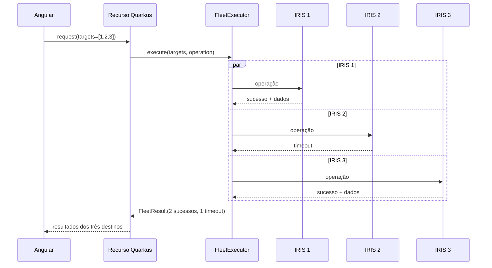

A configuração padrão usa seis workers, fila de 64 tarefas e timeout de frota de 15 segundos. Falhas de rede, autorização, operação não suportada, timeout e saturação tornam-se status por destino, como `OFFLINE`, `UNAUTHORIZED`, `FORBIDDEN`, `UNSUPPORTED`, `TIMEOUT` e `BUSY`.

O executor envia cada destino ao pool compartilhado e aguarda dentro do prazo restante da frota. A saturação da fila retorna `BUSY`. Ao atingir o timeout, ele chama `Future.cancel(true)` e informa `TIMEOUT`; a interrupção solicita o cancelamento, enquanto a conclusão do trabalho remoto depende do cliente e do servidor.

O pool em [FleetExecutor.java](backend/src/main/java/org/iris/multimanager/fleet/FleetExecutor.java) explicita a concorrência e a capacidade da fila:

```java
pool = new ThreadPoolExecutor(
    concurrency, concurrency, 0, TimeUnit.SECONDS,
    new ArrayBlockingQueue<>(64),
    Thread.ofPlatform().daemon().factory(),
    new ThreadPoolExecutor.AbortPolicy());
```

## Registro de instâncias e credenciais por sessão

`application.properties` armazena o registro de instâncias como um array JSON. Cada entrada define:

- ID interno e nome de exibição;
- URL-base da SysAdmin terminando em `/api/admin`;
- nome do ambiente;
- host e porta JDBC;
- namespace padrão;
- indicador de habilitação.

`InstanceRegistry` valida o registro completo na inicialização. O componente aceita até 32 instâncias, verifica a sintaxe dos IDs, permite somente HTTP e HTTPS, exige o caminho exato `/api/admin`, rejeita user information, query string e fragment na URL e valida os hosts HTTP e JDBC contra `fleet.allowed-hosts`. Essa allowlist restringe os destinos de saída e impede que a entrada do navegador transforme o backend em um proxy de rede aberto.

O fluxo de conexão é:

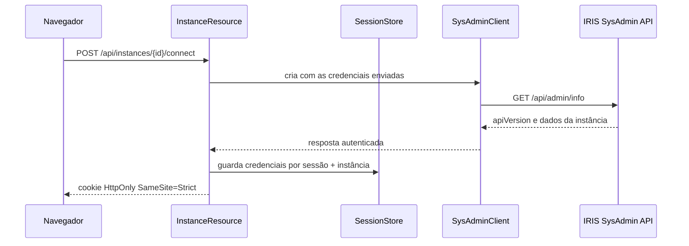

As credenciais permanecem no `SessionStore` em memória, com escopo por ID da sessão e ID da instância. Cada consulta a uma sessão válida renova sua expiração no servidor por 30 minutos. O cookie do navegador possui um `Max-Age` separado de 1.800 segundos, definido na conexão. O store aceita até 256 sessões. `CredentialContext.toString()` omite a senha de sua representação textual.

O cliente SysAdmin usa Basic Authentication, timeout de conexão de 3 segundos, timeout de requisição de 10 segundos, redirects desabilitados, limite de resposta de 4 MB e um conjunto restrito de padrões de caminhos administrativos.

## Modelagem de recursos e matrizes de comparação

Os recursos administrativos do IRIS usam caminhos e identificadores SysAdmin diferentes. `ResourceCatalog` armazena essas diferenças como dados:

```java
public record Definition(
    String listPath,
    String detailPath,
    String detailParameter,
    String key,
    Set<String> fields,
    Set<String> detailFields) {}
```

O catálogo cobre web applications, tarefas, usuários, papéis, recursos, coleções de wallet, credenciais X509, servidores OAuth e resource servers OAuth. `ResourceService` consulta cada lista e projeta somente os campos permitidos por `SafeMetadata`.

O construtor da matriz calcula a união das chaves retornadas pelos destinos bem-sucedidos e cria uma célula por instância. Para cada recurso, a primeira configuração disponível vira a referência de comparação. As configurações seguintes recebem `DIFFERENT` quando divergem e `PRESENT` quando coincidem. Uma resposta bem-sucedida sem o recurso recebe `MISSING`. Destinos com falha preservam seu status operacional, como `OFFLINE`.

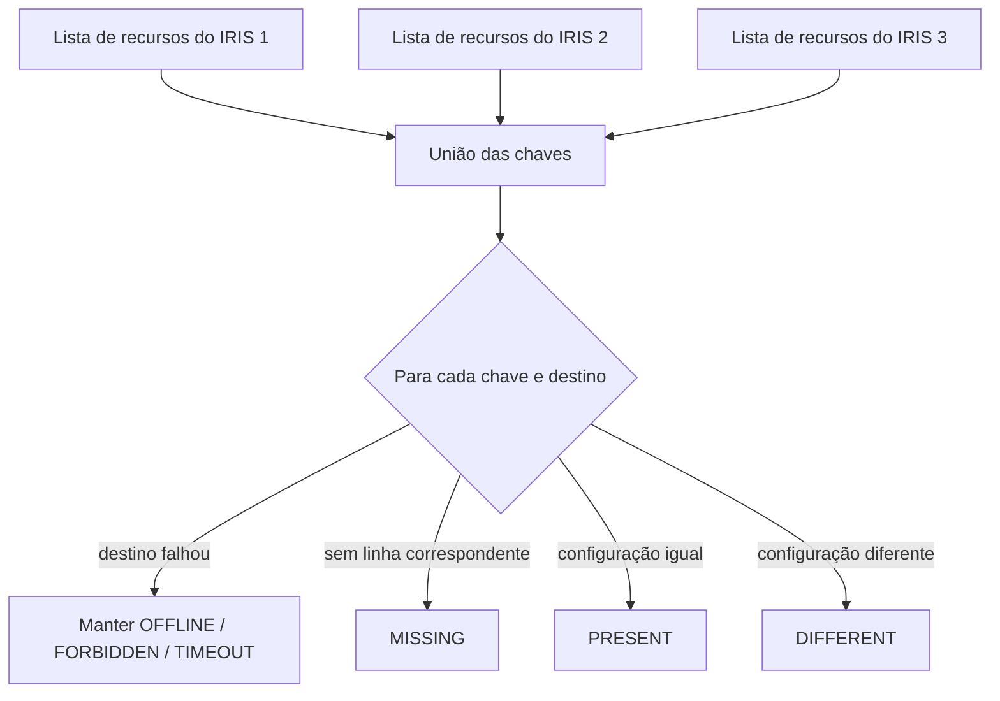

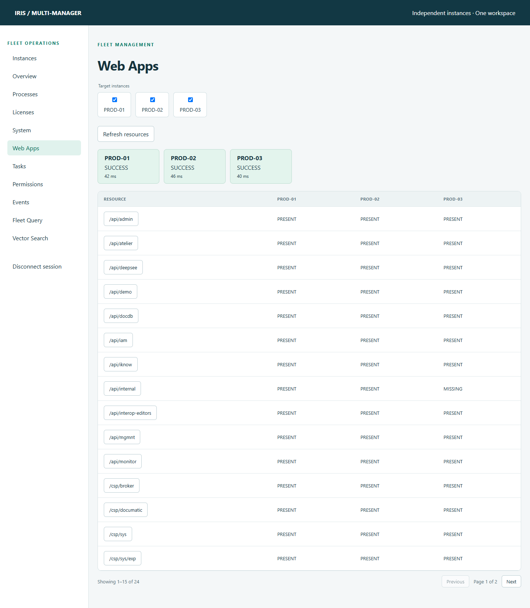

## Mutação segura com preflight e confirmação

Alterações em web applications e tarefas usam um fluxo em duas etapas. Para uma alteração de web application, o backend:

1. valida nome do recurso, quantidade de destinos, propriedade, tipo e intervalo;
2. lê a configuração atual em cada instância selecionada;
3. constrói uma prévia antes/depois;
4. armazena por dois minutos um plano imutável vinculado à sessão;
5. consome o plano uma única vez após a confirmação;
6. lê o recurso novamente para detectar configuração obsoleta;
7. grava somente os campos aprovados;
8. lê o recurso outra vez e verifica o resultado.

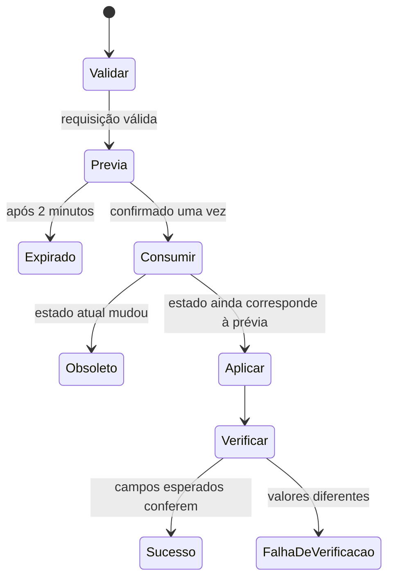

Cada `ConfirmedPlanStore` aceita até 128 planos pendentes, associa os planos à sessão de origem, remove entradas expiradas ao adicionar planos e consome cada token uma única vez. Web applications, tarefas e operações vetoriais possuem stores separados. As alterações em web applications aceitam `Description` com até 256 caracteres, `Enabled` Boolean e `Timeout` inteiro de 60 a 86.400.

A verificação depende da operação. Web applications comparam a prévia com a configuração atual e releem os campos alterados. Tarefas comparam identidade e configuração antes da execução; suspend e resume verificam `Suspended`, enquanto run informa aceitação assíncrona. A execução HNSW retorna após a chamada DDL, e o Angular recarrega o inventário. A regeneração vetorial retorna a quantidade de linhas afetadas.

O controle de processos acrescenta uma verificação de identidade. O frontend lê `StartTimeUTC`, e o backend relê o processo imediatamente antes de suspender, retomar ou terminar. Se o horário mudar, a operação retorna `STALE_PROCESS`, protegendo contra reutilização de PID.

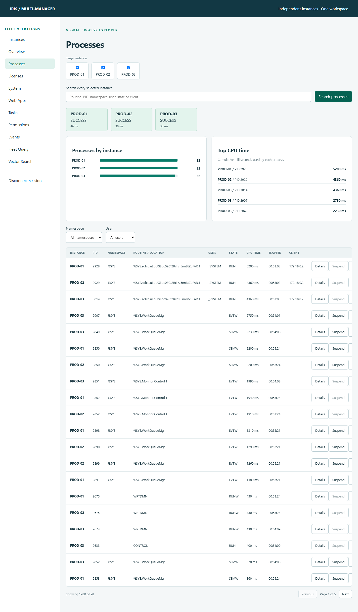

## Modelagem de monitoramento

A camada de monitoramento lê endpoints documentados da SysAdmin e converte os payloads em records tipados. `MonitorService` separa taxas, contadores acumulados e valores atuais:

- `GlobalRefsPerSecond` é uma taxa;
- `GlobalRefs`, `DiskReads` e `DiskWrites` são contadores desde a inicialização;
- quantidades de processos e sessões CSP representam valores atuais;
- percentuais de licença permanecem `null` quando o IRIS não retorna um número.

A saúde recebe `WARNING` quando o System Monitor está parado ou quando campos retornados, como espaço de banco, journal, lock table ou write daemon, não estão `Normal`.

Enquanto Overview está aberto, o Angular atualiza os dados a cada 15 segundos. O backend guarda no máximo 60 valores `MetricSample` por instância em memória. O gráfico curto representa o processo atual do backend e é apagado quando esse processo reinicia.

[MonitorService.java](backend/src/main/java/org/iris/multimanager/monitor/MonitorService.java) associa os endpoints às telas:

| Tela | Endpoint SysAdmin | Campos utilizados |
| --- | --- | --- |
| Overview | `/v2/monitor/dashboard/main` | `Performance`, `SystemUsage`, `Status`, `Alerts`, `Licensing` |
| Licenses | `/v2/monitor/license-usage` | `UsageByUser`, `UsageByProcess` |
| System | `/v2/monitor/system-usage` | Contadores de globals, rotinas, blocos, WIJ e journal |
| Memória compartilhada | `/v2/monitor/system-usage/shared-memory` | `SMHAllocated`, `SMHUsed`, `SMHAvailable`, `AllUsed` |

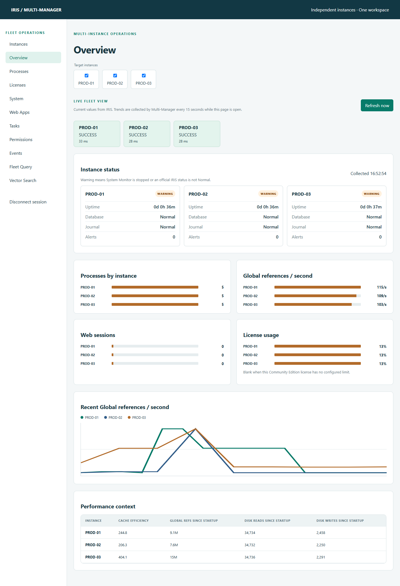

## Fleet Query: SQL somente leitura em várias instâncias

Fleet Query usa o driver InterSystems JDBC e as credenciais armazenadas para cada destino. Antes de o JDBC receber a instrução, `SelectOnlyGuard` remove comentários, aceita um ponto e vírgula final opcional, exige `SELECT` como primeira palavra-chave, rejeita outros pontos e vírgulas e bloqueia palavras-chave de escrita ou procedimento.

```java
if (normalized.isBlank()
    || normalized.contains(";")
    || !normalized.matches("(?is)^select\\b.*")) {
    throw new BadRequestException("Only one SELECT statement is allowed");
}
```

O serviço aplica estes limites:

- consulta com no máximo 10.000 caracteres;
- limite configurado de 500 linhas;
- timeout padrão de 15 segundos;
- timeout aceito de no máximo 60 segundos;
- `setMaxRows`, `setQueryTimeout` e fetch size limitado no JDBC;
- no máximo 32 destinos selecionados.

O guard SQL faz validação lexical com expressões regulares. As permissões da conta IRIS continuam sendo o limite de autorização para acesso ao banco. O timeout da consulta e o prazo da frota são separados: aceitar um timeout de consulta de 60 segundos mantém em vigor o prazo padrão de frota de 15 segundos.

### Da requisição Angular ao JDBC

[FleetQuery](frontend/src/app/features/fleet-query.ts) envia os destinos selecionados e os limites pela função compartilhada de API. Este trecho preserva a requisição e a atualização do signal:

```typescript
this.result.set(await api<QueryResult>('/query', {
  targets: this.selected(),
  sql: this.sql,
  maxRows: Number(this.maxRows),
  timeoutSeconds: 15
}));
```

A função serializa o corpo como JSON e envia `POST /api/query`. O Nginx encaminha a chamada para este endpoint de [QueryResource.java](backend/src/main/java/org/iris/multimanager/query/QueryResource.java), apresentado com a formatação expandida:

```java
@Path("/api/query")
@Produces(MediaType.APPLICATION_JSON)
@Consumes(MediaType.APPLICATION_JSON)
public class QueryResource {
    @Inject FleetQueryService service;

    @POST
    public FleetQueryService.QueryResult query(
            @CookieParam("IRIS_SESSION") String session,
            FleetQueryService.QueryRequest request) {
        return service.execute(session, request);
    }
}
```

O Quarkus converte o JSON em `QueryRequest` com Jackson e injeta `FleetQueryService`. O serviço valida SQL e limites, resolve os destinos e verifica as credenciais de sessão de todos os destinos antes de distribuir a operação. Uma credencial ausente nessa etapa rejeita a requisição. O executor chama este fluxo JDBC para cada destino:

```java
String url = "jdbc:IRIS://" + instance.jdbcHost() + ":"
    + instance.jdbcPort() + "/" + instance.defaultNamespace();
Properties props = new Properties();
props.setProperty("user", credential.username());
props.setProperty("password", credential.password());
try (Connection connection = DriverManager.getConnection(url, props);
     Statement statement = connection.createStatement()) {
    statement.setQueryTimeout(timeout);
    statement.setMaxRows(maxRows);
    statement.setFetchSize(Math.min(maxRows, 100));
    try (ResultSet result = statement.executeQuery(sql)) {
        var metadata = result.getMetaData();
        var columns = new ArrayList<String>();
        for (int n = 1; n <= metadata.getColumnCount(); n++)
            columns.add(metadata.getColumnLabel(n));
        var rows = new ArrayList<List<JsonNode>>();
        while (result.next() && rows.size() < maxRows) {
            var row = new ArrayList<JsonNode>();
            for (int n = 1; n <= metadata.getColumnCount(); n++)
                row.add(value(result.getObject(n)));
            rows.add(List.copyOf(row));
        }
        return new QueryData(List.copyOf(columns), List.copyOf(rows));
    }
}
```

[FleetQueryService.java](backend/src/main/java/org/iris/multimanager/query/FleetQueryService.java) converte os valores JDBC em nós Jackson: nulo, inteiro, decimal, Boolean ou texto. Seu `QueryResult` preserva os campos de status da frota e expõe `columns` e `rows` diretamente em cada destino. O Angular atualiza o signal de resultado e renderiza uma tabela por instância.

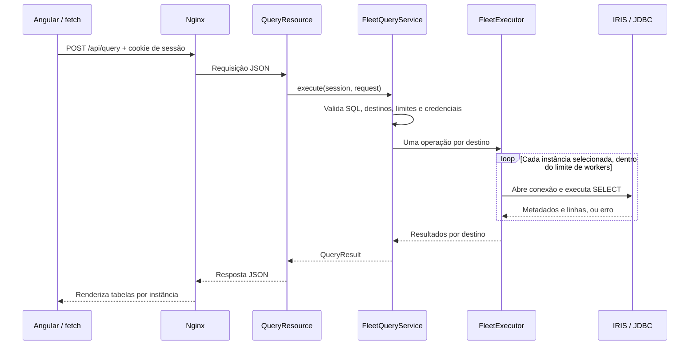

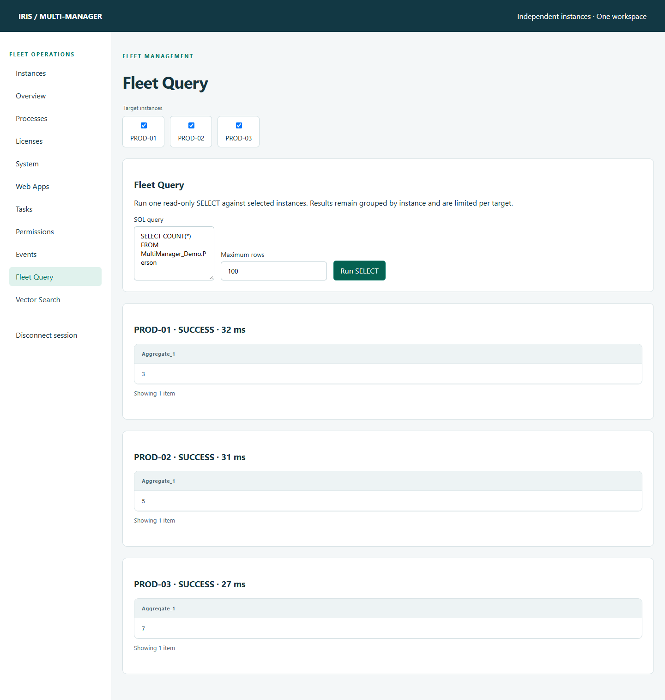

## Gerenciamento vetorial no ecossistema IRIS

O workspace vetorial combina metadados nativos do IRIS, SQL, ObjectScript, Embedded Python e operações HNSW.

### Descoberta de `VECTOR` e `EMBEDDING`

O backend descobre nomes SQL e tipos vetoriais pelo dicionário de classes:

```sql
SELECT p.parent, p.Name, p.SqlFieldName, p.Type, p.Parameters,
       c.SqlTableName, c.SqlSchemaName
FROM %Dictionary.CompiledProperty p
JOIN %Dictionary.CompiledClass c ON c.ID = p.parent
WHERE p.Type IN ('%Library.Vector', '%Library.Embedding')
  AND LEFT(c.SqlSchemaName, 1) <> '%'
```

O código usa `%Dictionary.CompiledIndex` para identificar definições HNSW, `%Dictionary.CompiledStorage` para globals de dados e índices e `%Embedding.Config` para provedores de embedding. Os bancos padrão do namespace e os mappings de globals/pacotes da SysAdmin são combinados com os metadados de storage para resolver os bancos que armazenam dados, índices e código. O mapping correspondente mais longo vence. Locais sem resolução aparecem como `UNKNOWN`.

A configuração de embedding é interpretada como JSON e sanitizada recursivamente. Chaves como `apiKey`, `token`, `password`, `secret` e `clientSecret` tornam-se `[REDACTED]` antes de a resposta chegar ao Angular.

### Procedimentos SQL ObjectScript e Embedded Python

`MultiManager.Vector.Extension` expõe métodos controlados como procedimentos SQL. O JDBC chama esses procedimentos, e o IRIS executa as implementações por meio do Embedded Python.

```objectscript
ClassMethod CheckLibrary(moduleName As %String) As %String [ Language = python, SqlName = MM_VectorCheckLibrary, SqlProc ]
{
    import importlib.util
    import json
    import re

    if not re.fullmatch(r"[A-Za-z_][A-Za-z0-9_]{0,127}", moduleName or ""):
        raise ValueError("Use a top-level Python module name, such as sentence_transformers")
    try:
        available = importlib.util.find_spec(moduleName) is not None
        return json.dumps({"module": moduleName, "available": available,
                           "message": "Module found" if available else "Module not found"})
    except Exception:
        return json.dumps({"module": moduleName, "available": None,
                           "message": "Module discovery failed"})
}
```

Esse método vem de [Extension.cls](docker/iris/src/MultiManager/Vector/Extension.cls). `Language = python` seleciona a linguagem da implementação; `SqlProc` e `SqlName` a expõem ao SQL. O Java vincula o nome do módulo como parâmetro em `SELECT MultiManager_Vector.MM_VectorCheckLibrary(?)` e interpreta o JSON retornado com Jackson.

`find_spec` verifica a descoberta do módulo. Um resultado positivo informa que o módulo pode ser localizado; importação, dependências transitivas e carregamento de modelos exigem verificações próprias. A extensão também informa a versão do Embedded Python, testa uma receita vetorial determinística e suporta regeneração. Nesta demo, `CheckModel` retorna `ready: false`, e `DownloadModel` retorna `downloaded: false`.

### Provedor nativo de `EMBEDDING`

O provedor demo estende `%Embedding.Interface`. Este trecho mostra o método de embedding de [DemoEmbedding.cls](docker/iris/src/MultiManager/Vector/DemoEmbedding.cls); a classe também implementa validação de configuração e um método auxiliar JSON:

```objectscript
Class MultiManager.Vector.DemoEmbedding Extends %Embedding.Interface
{
ClassMethod Embedding(input, configuration) As %Vector [ Language = python ]
{
    import hashlib, json
    digest = hashlib.sha256(str(input).encode("utf-8")).digest()
    values = [((digest[i] / 255.0) * 2.0) - 1.0 for i in range(4)]
    return json.dumps(values)
}
}
```

PROD-01 e PROD-02 contêm uma coluna `EMBEDDING` baseada nesse provedor e um índice HNSW. PROD-03 contém uma coluna direta `VECTOR(DOUBLE,4)` sem o índice HNSW inicial. A diferença controlada permite comparar a frota sem modelo externo ou dependência de rede.

O provedor converte quatro bytes de SHA-256 em valores numéricos. Esses dados determinísticos exercitam os caminhos de armazenamento e execução; suas coordenadas não carregam significado semântico aprendido. As imagens de PROD-01 e PROD-02 instalam `sentence-transformers` para verificações de capacidade. A receita vetorial usa a biblioteca padrão do Python.

Após registrar `multimanager-demo` em `%Embedding.Config` com a classe do provedor e comprimento vetorial 4, [Seed.cls](docker/iris/src/MultiManager/Demo/Seed.cls) cria estes recursos SQL:

```sql
CREATE TABLE MultiManager_Vector.EmbeddingDocument (
    ID INTEGER IDENTITY PRIMARY KEY,
    Title VARCHAR(100),
    Content VARCHAR(1000),
    EmbeddingData EMBEDDING('multimanager-demo','Content')
);

CREATE INDEX EmbeddingHNSW
ON TABLE MultiManager_Vector.EmbeddingDocument (EmbeddingData)
AS HNSW(Distance='Cosine');
```

O seed calcula explicitamente os vetores com `EmbeddingJSON` e os insere usando `TO_VECTOR(?,DOUBLE)`. `EMBEDDING` mantém os metadados do provedor e da coluna de origem que o inventário consulta depois.

### Ciclo de vida controlado de HNSW

As operações de criação, reconstrução e remoção resolvem um ativo descoberto em schema, tabela e coluna. O nome de índice solicitado passa por validação de sintaxe, e os identificadores SQL são delimitados. O navegador recebe o SQL planejado e uma frase para digitar na confirmação. A aplicação consome um token vinculado à sessão, com validade de dois minutos, e executa o plano armazenado. A criação HNSW valida `M` de 2 a 100, `efConstruction` maior que `M` e no máximo 1.000, e usa distância `Cosine` ou `DotProduct`.

A regeneração suporta a receita de `VECTOR` direto com quatro dimensões. A interface seleciona a linha 1; o backend aceita um ID positivo, lê seu `Content`, chama `MM_VectorRegenerate(?)` e grava o JSON retornado por meio de `TO_VECTOR(?,DOUBLE)`, com o ID da linha parametrizado. [VectorService.java](backend/src/main/java/org/iris/multimanager/vector/VectorService.java) implementa esse fluxo.

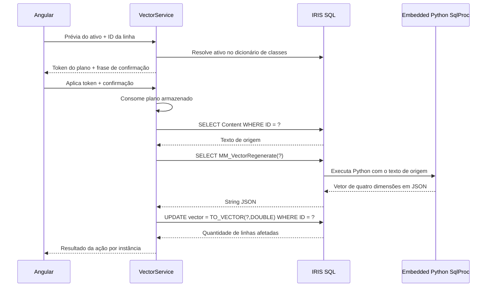

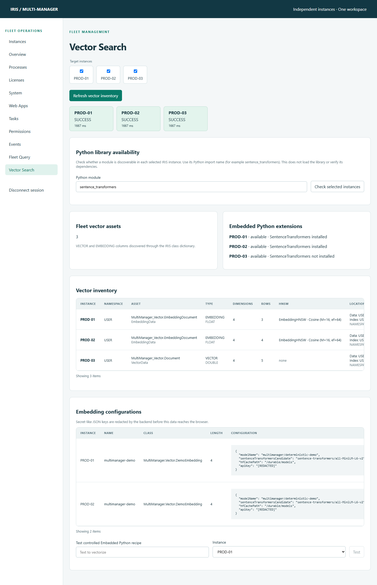

## Implementação Angular

O frontend Angular usa componentes standalone e interfaces tipadas compatíveis com os records do backend. Uma função `api<T>()` envia requisições de mesma origem com credenciais, adiciona `X-Requested-With: IRIS-Multi-Manager` e transforma respostas não 2xx em erros apresentados ao usuário.

O transporte em [api.ts](frontend/src/app/api.ts) usa a API `fetch` do navegador. As opções da requisição são:

```typescript
const response = await fetch('/api' + path, {
  method: body === undefined ? 'GET' : 'POST',
  credentials: 'same-origin',
  headers: {
    'Content-Type': 'application/json',
    'X-Requested-With': 'IRIS-Multi-Manager'
  },
  body: body === undefined ? undefined : JSON.stringify(body)
});
```

O TypeScript descreve o formato esperado da resposta em tempo de compilação. A função retorna `response.json()`; a validação dos dados e a projeção de campos ocorrem no backend. Os formulários Angular vinculam SQL, filtros e campos de confirmação, enquanto `signal()` armazena resultados, progresso, erros e seleção de página.

Signals mantêm o estado local de cada workspace. Componentes compartilhados implementam:

- seleção de instâncias;
- cartões de resultado por destino;
- matrizes de recursos;
- comparação de configuração antes/depois;
- barras de métricas e gráficos de tendência;
- paginação reutilizável no cliente.

A interface preserva as fronteiras entre destinos. Fleet Query renderiza uma seção e um paginador separados para cada servidor, e as matrizes de recursos mantêm as falhas em suas células originais.

## Demonstração em Docker e modelagem dos dados

O Docker Compose inicia cinco serviços:

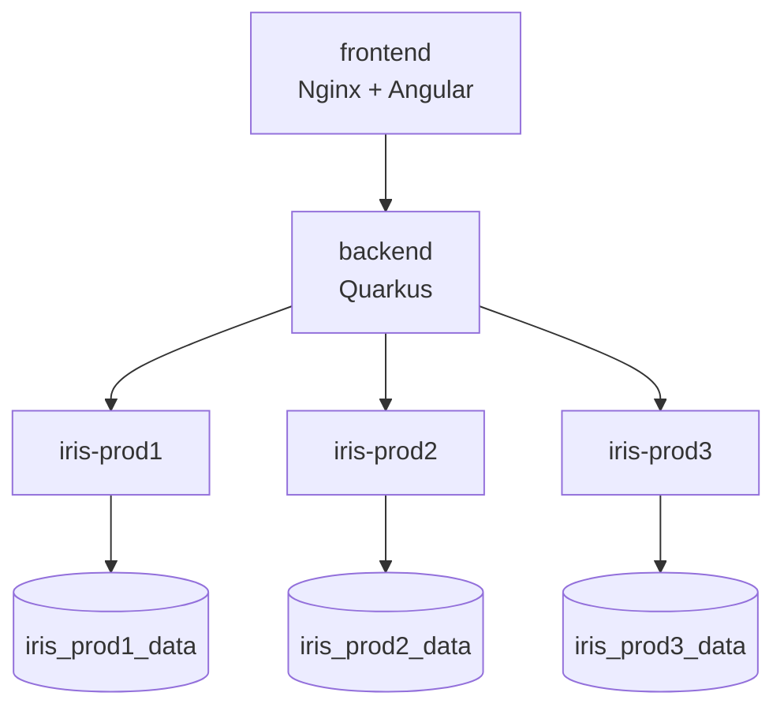

Cada instância IRIS possui um volume durável. A imagem customizada carrega classes ObjectScript e uma rotina worker durante o build. Na inicialização, `start-demo.sh` recompila o código e executa `MultiManager.Demo.Seed`.

`DEMO_PROFILE` cria diferenças controladas:

- quantidades diferentes de registros persistentes `MultiManager.Demo.Person`;
- `/api/internal` ausente em PROD-03;
- tarefa `DemoAudit` criada somente em PROD-02;
- um processo worker demo em cada instância;
- ativos de vector e embedding e quantidades de linhas diferentes.

O modelo persistente em [Person.cls](docker/iris/src/MultiManager/Demo/Person.cls) é:

```objectscript
Class MultiManager.Demo.Person Extends %Persistent
{
Property Name As %String;
Property InstanceName As %String;
}
```

O Embedded Python de `Seed.Run()` cria objetos pela API do IRIS. Este trecho executa dentro da verificação de primeira execução do seed:

```python
counts = {"PROD1": 3, "PROD2": 5, "PROD3": 7}
person_class = iris.cls("MultiManager.Demo.Person")
for number in range(1, counts[profile] + 1):
    person = person_class._New()
    person.Name = f"Person {number}"
    person.InstanceName = profile
    iris.check_status(person._Save())
```

O IRIS projeta esses objetos como `MultiManager_Demo.Person`, a tabela consultada por JDBC. O marcador `^MultiManagerDemo("seeded")` evita a criação repetida de pessoas e tarefas em reinicializações normais. Os volumes persistentes mantêm os dados e as alterações anteriores da demo.

A imagem do frontend executa `npm ci` e `npm run build` em Node.js e copia o bundle para o Nginx. A imagem do backend executa Maven `verify` com Java 21 e copia `quarkus-app` para uma imagem JRE. O Compose conecta essas imagens a três serviços IRIS, cada um com seu `DEMO_PROFILE` e volume `/durable`. Os Dockerfiles do frontend e backend definem verificações de saúde HTTP; o Compose verifica cada processo IRIS com `iris qlist`.

## Limites de segurança implementados no código

A aplicação aplica estes controles:

- hosts HTTP e JDBC externos precisam estar registrados e na allowlist;
- caminhos SysAdmin são limitados e redirects ficam desabilitados;
- credenciais permanecem em uma sessão do backend com prazo de expiração;
- requisições diferentes de GET, HEAD e OPTIONS exigem `X-Requested-With: IRIS-Multi-Manager`;
- respostas da API usam `Cache-Control: no-store` e `X-Content-Type-Options: nosniff`;
- o Nginx adiciona cabeçalhos de frame, referrer e content type;
- corpos de requisição são limitados a 64 KB;
- metadados administrativos usam allowlists explícitas de campos;
- chaves semelhantes a segredos em embeddings são ocultadas recursivamente;
- Fleet Query valida a sintaxe SELECT e aplica limites de linhas e tempo de consulta;
- identificadores vetoriais vêm de metadados descobertos e validação estrita;
- planos de ação expiram, pertencem a uma sessão e podem ser consumidos uma vez;
- mutações em processos verificam o horário inicial para detectar reutilização de PID.

`ApiProtection` verifica o cabeçalho customizado, e o navegador usa um cookie de sessão `SameSite=Strict`. As permissões IRIS autorizam as operações subjacentes. O [README](README.md#security-and-operational-notes) descreve os requisitos de implantação para autenticação do frontend, TLS, papéis, gestão de segredos, política de rede e retenção de auditoria.

## Estratégia de testes

A imagem do backend executa `mvn verify` durante o build multi-stage do Docker. Os testes unitários cobrem:

- isolamento de falhas parciais e concorrência limitada;
- timeouts de frota e mapeamento de erros de autenticação;
- identidade composta de processos;
- validação de URLs externas;
- escopo de credenciais por sessão e destino;
- segurança de recursos e allowlist de campos;
- validação das propriedades mutáveis;
- rejeição de SQL que não seja somente leitura;
- validação de identificadores vetoriais e ocultação recursiva de segredos;
- semântica das métricas e histórico com tamanho limitado.

A suíte de smoke tests em PowerShell exercita o ambiente real com cinco containers. Ela autentica nos três servidores IRIS, pesquisa processos, compara recursos, testa monitoramento e licenciamento, executa Fleet Query, verifica ocultação de segredos, chama procedimentos SQL com Embedded Python, regenera uma linha vetorial e cria depois remove um índice HNSW. Também verifica que um plano vetorial consumido não pode ser reutilizado.

Por exemplo, [FleetExecutorTest.java](backend/src/test/java/org/iris/multimanager/fleet/FleetExecutorTest.java) simula um destino inacessível e verifica os resultados bem-sucedidos e a identidade de origem. As asserções centrais são:

```java
var result = executor.execute(targets(), i -> {
    if (i.id().equals("b")) throw new java.net.ConnectException();
    return 42;
});
assertEquals(2, result.successCount());
assertEquals("OFFLINE", result.results().get(1).status());
assertEquals("c", result.results().get(2).instanceId());
```

Após iniciar a demo, execute verificações representativas em PowerShell:

```powershell
./scripts/smoke.ps1
./scripts/smoke-query.ps1
./scripts/smoke-webapps.ps1
./scripts/smoke-vector-library.ps1
./scripts/smoke-vector.ps1
```

Esses scripts operam sobre os dados da demo. A verificação de web applications restaura as descrições originais em `finally`; a verificação vetorial regenera a linha 1 e cria depois remove `SmokeHNSW`. O [README](README.md#validation-logs-and-shutdown) lista a suíte completa.

## Exemplo: da requisição de frota ao resultado operacional

### Conferir dados e configuração em três servidores

O administrador pode usar a demo para verificar a presença de recursos, comparar volumes de dados e aplicar uma alteração de configuração com escopo definido. Inicie o ambiente com os comandos de **Executando o projeto**, abra [http://localhost:8080](http://localhost:8080), selecione PROD-01, PROD-02 e PROD-03 em **Instances** e conecte-se com `_SYSTEM` / `SYS`.

Em **Fleet Query**, execute:

```sql
SELECT InstanceName, COUNT(*) AS Total
FROM MultiManager_Demo.Person
GROUP BY InstanceName
```

Um ambiente recém-populado pelo seed contém estes dados:

| Verificação | PROD-01 | PROD-02 | PROD-03 |
| --- | --- | --- | --- |
| `InstanceName` / quantidade de pessoas | `PROD1` / 3 | `PROD2` / 5 | `PROD3` / 7 |
| `/api/internal` em Web Apps | Presente | Presente | Ausente |
| `DemoAudit` em Tasks | Ausente | Presente | Ausente |
| Ativo vetorial | `EmbeddingDocument.EmbeddingData` | `EmbeddingDocument.EmbeddingData` | `Document.VectorData` |
| Linhas vetoriais | 3 | 4 | 5 |
| Índice HNSW inicial | `EmbeddingHNSW` | `EmbeddingHNSW` | Nenhum |

A interface mostra as linhas SQL separadas por instância. As contagens ajudam a verificar o seed esperado ou investigar diferenças no volume de dados. Abra **Web Apps** e **Tasks** para distinguir ausência de recursos de divergências de configuração. Volumes existentes podem conter alterações de execuções anteriores; compare seu estado com os dados iniciais acima.

### Localizar o processo responsável pelo trabalho

Abra **Processes**, pesquise `DemoWorker` e selecione **Details** em uma linha retornada. Uma demo recém-iniciada tem um worker por instância. A requisição segue este caminho:

1. O Angular envia `GET /api/processes?instances=prod1,prod2,prod3&filter=DemoWorker`.
2. O Quarkus resolve os três IDs pelo `InstanceRegistry`.
3. O `FleetExecutor` executa uma chamada SysAdmin limitada por destino.
4. Cada resposta de `/v2/processes` recebe `instanceId` e `instanceName`.
5. O backend devolve um `FleetResult` com três resultados independentes.
6. O Angular ordena e pagina as linhas bem-sucedidas, enquanto os cartões preservam o status e o tempo de cada servidor.

O operador pode associar os detalhes do processo ao servidor cujos dados ou configuração precisam de investigação.

### Aplicar e verificar uma alteração de configuração

Use a web application demo para exercitar o fluxo completo de preflight:

1. Em **Web Apps**, selecione somente PROD-01 e PROD-02.
2. Abra `/api/demo` e registre o valor atual de `Description` em cada instância.
3. Escolha `Description` e informe `Fleet validation example`.
4. Selecione **Preflight selected instances**. Confira os valores antes/depois e a prontidão dos dois destinos. A prévia realiza somente leituras.
5. Confirme dentro de dois minutos e revise cada resultado. `SUCCESS` indica que os campos alterados passaram pela verificação de releitura.
6. Recarregue a configuração para conferir a descrição armazenada. Ao terminar, restaure cada valor original por meio de uma nova prévia e confirmação.

A requisição montada pela interface possui este formato:

```json
{
  "targets": ["prod1", "prod2"],
  "name": "/api/demo",
  "changes": {"Description": "Fleet validation example"}
}
```

`POST /api/web-apps/preview` retorna um `operationId`. A confirmação envia `{"confirmed":true}` para `POST /api/web-apps/execute/{operationId}`. Uma mudança de configuração entre essas chamadas produz `STALE_CONFIGURATION` para o destino afetado. O operador pode inspecionar esse destino e gerar uma nova prévia.

### Verificar os recursos vetoriais

Em **Vector Search**, selecione novamente as três instâncias e inspecione os ativos da tabela de dados iniciais. Verifique `sentence_transformers` para comparar a descoberta do módulo nas três imagens e use **Test** com um texto de exemplo para executar a receita Python de quatro dimensões.

Para uma alteração controlada de índice, localize `Document.VectorData` em PROD-03, selecione **Create HNSW**, revise o SQL e digite a frase de confirmação exibida. A interface solicita `VectorHNSW` com `Cosine`, `M=16` e `efConstruction=64`, e recarrega o inventário após a aplicação. Confira a presença do índice; **Drop** usa uma nova prévia para remover o índice de demonstração ao terminar.

O exercício verifica dados, processos, configuração, disponibilidade Python e estado dos índices em um workspace, preservando o resultado de cada servidor.

## Impacto em um ambiente IRIS

O código separa pontos de integração que um desenvolvedor pode estender:

- Famílias de recursos usam `ResourceCatalog` para caminhos de endpoints, chaves de identidade e campos permitidos, e `ResourceService` para consulta e comparação.
- Novos servidores entram por `fleet.instances` e `fleet.allowed-hosts` em [application.properties](backend/src/main/resources/application.properties), seguidos de um rebuild do backend. A interface conecta-se ao registro configurado.
- As operações JDBC usam o `defaultNamespace` de cada instância. O inventário vetorial e as verificações de capacidade exigem a extensão fornecida nesse namespace; a demo a instala em `USER`.
- Um provedor de embedding implementa `%Embedding.Interface` e possui uma configuração em `%Embedding.Config`. Adaptar a regeneração demo a outro modelo exige alterações correspondentes na receita fixa, nas dimensões e na coluna de origem.

Esses limites mantêm o registro de servidores, a descoberta de recursos e a implementação do provedor explícitos na estrutura do projeto.

## Executando o projeto

Na raiz do repositório:

```bash
docker compose up -d --build
docker compose ps
```

Use Docker com o plugin Compose e pelo menos 8 GB de memória livre disponível para o Docker. A demo completa usa as portas do host `8080`, `8081`, `52773`–`52775` e `1972`–`1974`. O primeiro build baixa imagens e dependências, incluindo a instalação do pacote Python em PROD-01 e PROD-02.

Depois que os cinco serviços estiverem saudáveis, abra [http://localhost:8080](http://localhost:8080) e conecte-se às três instâncias demo com `_SYSTEM` / `SYS`. Essas credenciais pertencem à demo local. O [README](README.md) contém instruções de instalação, registro de servidores externos, uso e validação.

## Conclusão

A demo conecta persistência de objetos, consultas SQL, APIs administrativas e Embedded Python a uma interface web compartilhada. Seus padrões de desenvolvimento — identidade de instância, execução limitada, projeção de campos e planos de prévia — fornecem uma base para adicionar operações de frota com escopo explícito e resultados por servidor.
