# IRIS Multi-Manager

IRIS Multi-Manager is a web console for administrators who operate multiple independent [InterSystems IRIS](https://www.intersystems.com/data-platform/) instances. It provides fleet-wide visibility, comparison, monitoring, read-only SQL, and selected management actions from one workspace while keeping every result tied to its source instance.

The project was created for the [InterSystems Programming Contest: Build Your Own Management Portal](https://community.intersystems.com/post/intersystems-programming-contest-build-your-own-management-portal).

## Table of contents

- [Project overview](#project-overview)
- [What problem it solves](#what-problem-it-solves)
- [Architecture](#architecture)
- [Download and install with Docker](#download-and-install-with-docker)
- [First login](#first-login)
- [How to use each menu](#how-to-use-each-menu)
- [Connect the fleet to other IRIS servers](#connect-the-fleet-to-other-iris-servers)
- [Configuration reference](#configuration-reference)
- [Validation, logs, and shutdown](#validation-logs-and-shutdown)
- [Security and operational notes](#security-and-operational-notes)

## Project overview

The standard IRIS Management Portal manages one instance at a time. IRIS Multi-Manager adds a fleet view on top of the IRIS SysAdmin API and JDBC so an administrator can answer four practical questions:

- Where does a process or resource exist?
- Where is it missing?
- What configuration differs between servers?
- What happened on each target when a fleet operation ran?

The application includes:

- A responsive Angular 21 frontend served by Nginx.
- A Quarkus 3 / Java 21 backend that manages the instance registry, sessions, bounded requests, and per-instance results.
- Three optional IRIS Community demo containers with deliberately different data and configurations.
- SysAdmin API integration for processes, monitoring, resources, security metadata, and audit events.
- JDBC integration for read-only fleet queries and vector metadata.
- Controlled vector management for `VECTOR`, `EMBEDDING`, Embedded Python recipes, and HNSW indexes.

## What problem it solves

Switching among several Management Portal sessions makes it difficult to compare systems and easy to miss a partial failure. Multi-Manager sends the same read or supported operation to selected instances and presents each outcome separately. An unavailable server does not hide successful results from the remaining servers.

Fleet operations are not distributed transactions. If a change succeeds on PROD-01 and fails on PROD-02, the PROD-01 change remains applied and both outcomes are shown.

## Architecture

```text
Browser
  └─ Angular / Nginx :8080
       └─ Quarkus API :8081
            ├─ SysAdmin API ── IRIS instance 1
            ├─ SysAdmin API ── IRIS instance 2
            ├─ SysAdmin API ── IRIS instance N
            └─ JDBC
                 ├─ Fleet Query
                 ├─ vector metadata and source rows
                 ├─ HNSW operations
                 └─ SQL procedures → Embedded Python inside IRIS
```

The backend authenticates independently against each selected IRIS server. Credentials stay in the backend session and are not returned to the browser. The managed servers do not require a general-purpose Multi-Manager agent. The bundled demo adds only demo data and a small optional vector extension to its IRIS images.

## Download and install with Docker

### Prerequisites

- [Git](https://git-scm.com/downloads), or the repository downloaded as a ZIP file.
- [Docker Desktop](https://www.docker.com/products/docker-desktop/) or Docker Engine with the Docker Compose plugin.
- At least 8 GB of free memory available to Docker.
- Free local ports `8080`, `8081`, `52773`–`52775`, and `1972`–`1974` for the complete demo.

### 1. Download the project

```bash
git clone https://github.com/Davi-Massaru/IRIS-multi-manager.git
cd IRIS-multi-manager
```

If Git is not available, use **Code → Download ZIP** on GitHub, extract the archive, and open a terminal in the extracted `IRIS-multi-manager` directory.

### 2. Build and start the environment

```bash
docker compose up -d --build
```

The first build downloads the IRIS, Java, Node.js, and Python dependencies and can take several minutes. The demo does not download external machine-learning models.

### 3. Check container health

```bash
docker compose ps
```

Wait until `frontend`, `backend`, `iris-prod1`, `iris-prod2`, and `iris-prod3` report `healthy`. Then open [http://localhost:8080](http://localhost:8080).

### Demo addresses and credentials

| Service | Address | Credentials |
| --- | --- | --- |
| IRIS Multi-Manager | [http://localhost:8080](http://localhost:8080) | Enter the IRIS credentials in **Instances** |
| Backend health/API | [http://localhost:8081/q/health](http://localhost:8081/q/health) | No application login page is served here |
| PROD-01 Management Portal | [http://localhost:52773/csp/sys/UtilHome.csp](http://localhost:52773/csp/sys/UtilHome.csp) | `_SYSTEM` / `SYS` |
| PROD-02 Management Portal | [http://localhost:52774/csp/sys/UtilHome.csp](http://localhost:52774/csp/sys/UtilHome.csp) | `_SYSTEM` / `SYS` |
| PROD-03 Management Portal | [http://localhost:52775/csp/sys/UtilHome.csp](http://localhost:52775/csp/sys/UtilHome.csp) | `_SYSTEM` / `SYS` |

The password in `docker-compose.yml` is intentionally public for this local demo. Never reuse it on a real system.

## First login

1. Open [http://localhost:8080](http://localhost:8080).
2. Keep PROD-01, PROD-02, and PROD-03 selected.
3. Enter username `_SYSTEM` and password `SYS`.
4. Select **Connect**.
5. Confirm that each instance reports `SUCCESS`. The application opens **Overview** after at least one connection succeeds.

The web application has no separate user database. It uses the credentials supplied for the selected IRIS instances. If servers require different accounts, select and connect to each compatible group separately during the same browser session.

## How to use each menu

Every workspace begins with **Target instances**. Select only the servers that should receive the next query or supported operation. Long result sets are paginated in the browser; use **Previous** and **Next** below a table to move through the complete result without re-running the request.

### Instances

Use **Instances** to select targets, start authenticated IRIS sessions, review connection status, and disconnect the complete browser session. A failed target is displayed independently from successful targets.

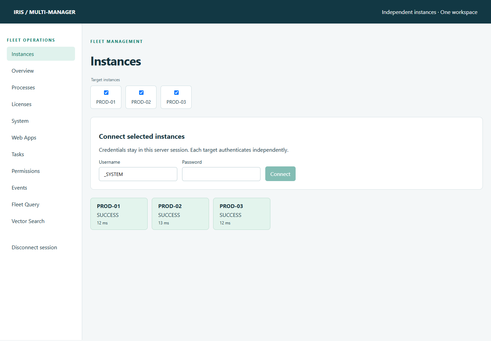

### Overview

**Overview** refreshes every 15 seconds while it is open. It shows current instance health, uptime, database and journal status, alerts, process counts, global references per second, web sessions, license usage, recent in-memory trends, and performance counters.

The backend retains up to 60 samples per instance for the current application run. Restarting the backend clears these trends.

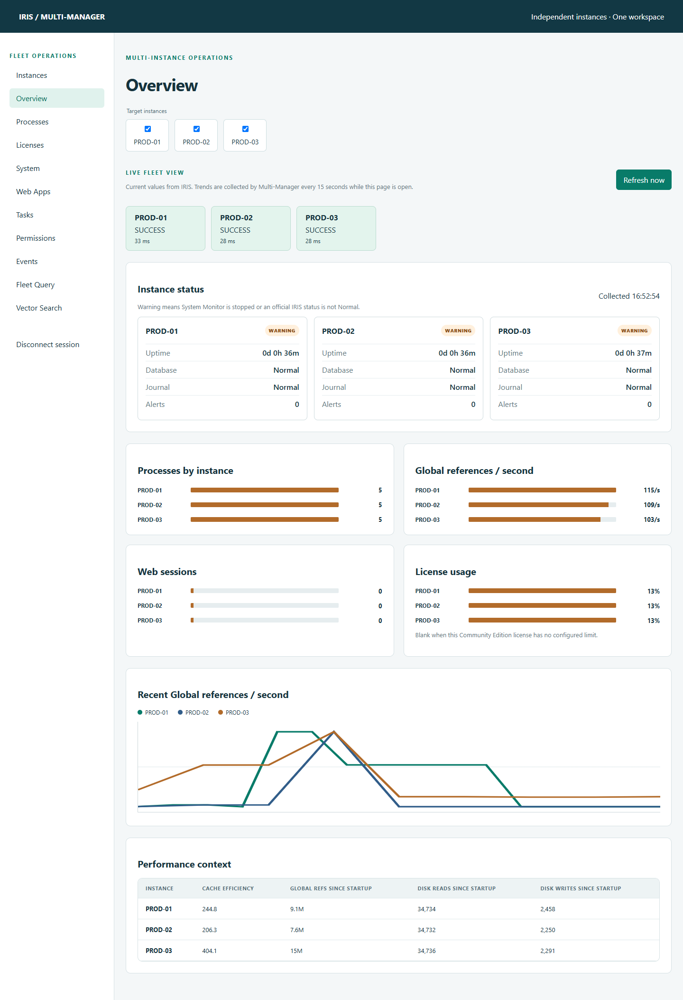

### Processes

1. Select the target instances.
2. Enter an optional routine, PID, namespace, user, state, or client filter.
3. Select **Search processes**.
4. Use the namespace and user filters to narrow the combined result.
5. Select **Details** to inspect a process on its owning server.
6. For supported actions, choose **Suspend**, **Resume**, or **Terminate**, then type the displayed instance/PID confirmation phrase.

Before an action runs, the backend verifies the process start time again to reduce the risk of acting on a reused PID.

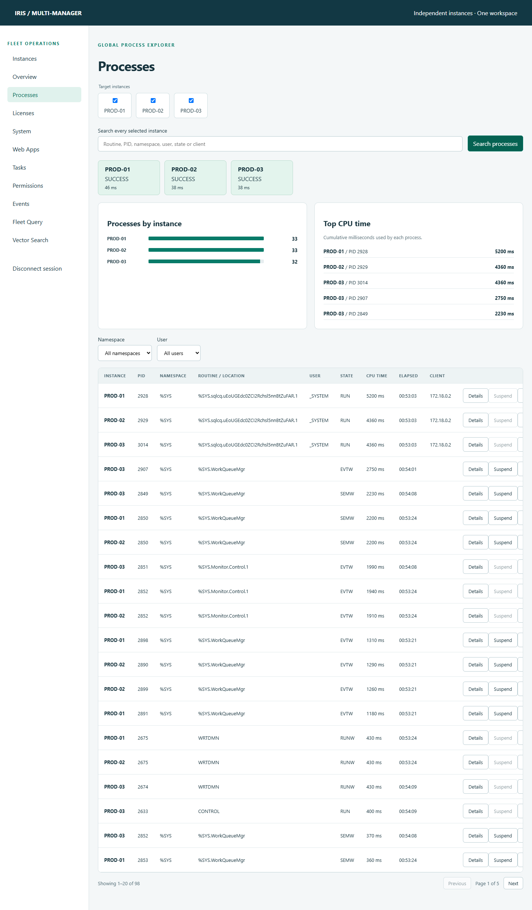

### Licenses

**Licenses** compares current and high-water usage, unit limits, usage by user, and usage by process. Select a PID to open the corresponding process detail. Community Edition can return no configured limit; Multi-Manager displays that value as unavailable instead of inventing a percentage.

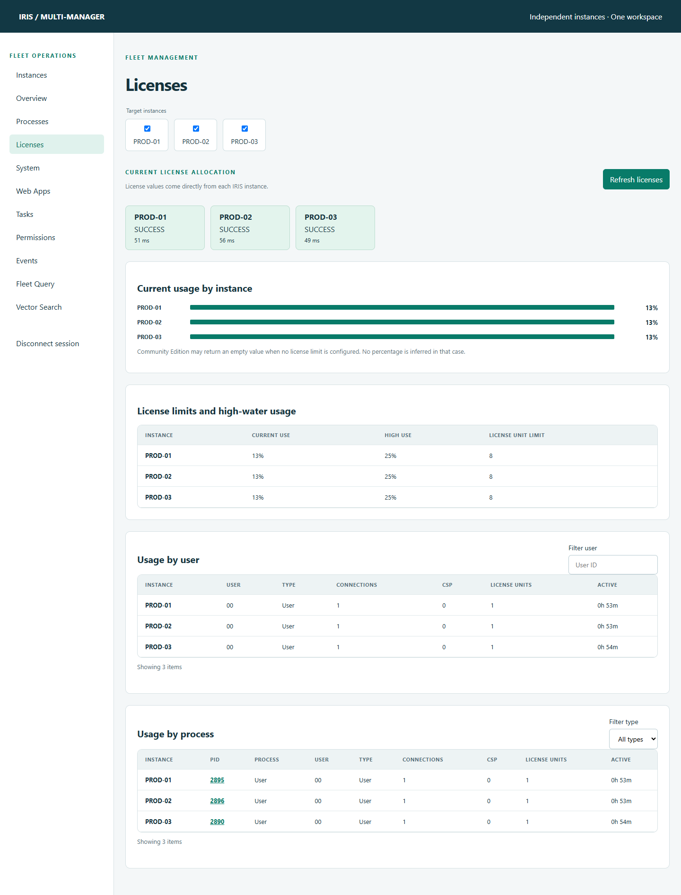

### System

**System** displays cumulative counters since each IRIS instance started, including global references, updates, block activity, routine calls, journal activity, and shared-memory allocation. Compare servers with their uptime in mind because these values are counters, not rates.

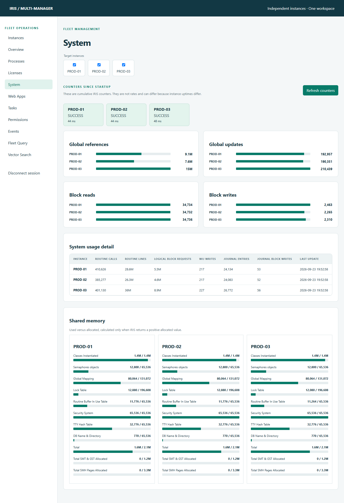

### Web Apps

**Web Apps** builds a presence matrix across the selected fleet. Select an application name to compare configuration. Supported properties can be changed through a two-step workflow:

1. Choose `Description`, `Enabled`, or `Timeout` and enter the new value.
2. Select **Preflight selected instances**.
3. Review the before/after values and readiness for each server.
4. Confirm the change for the ready targets.

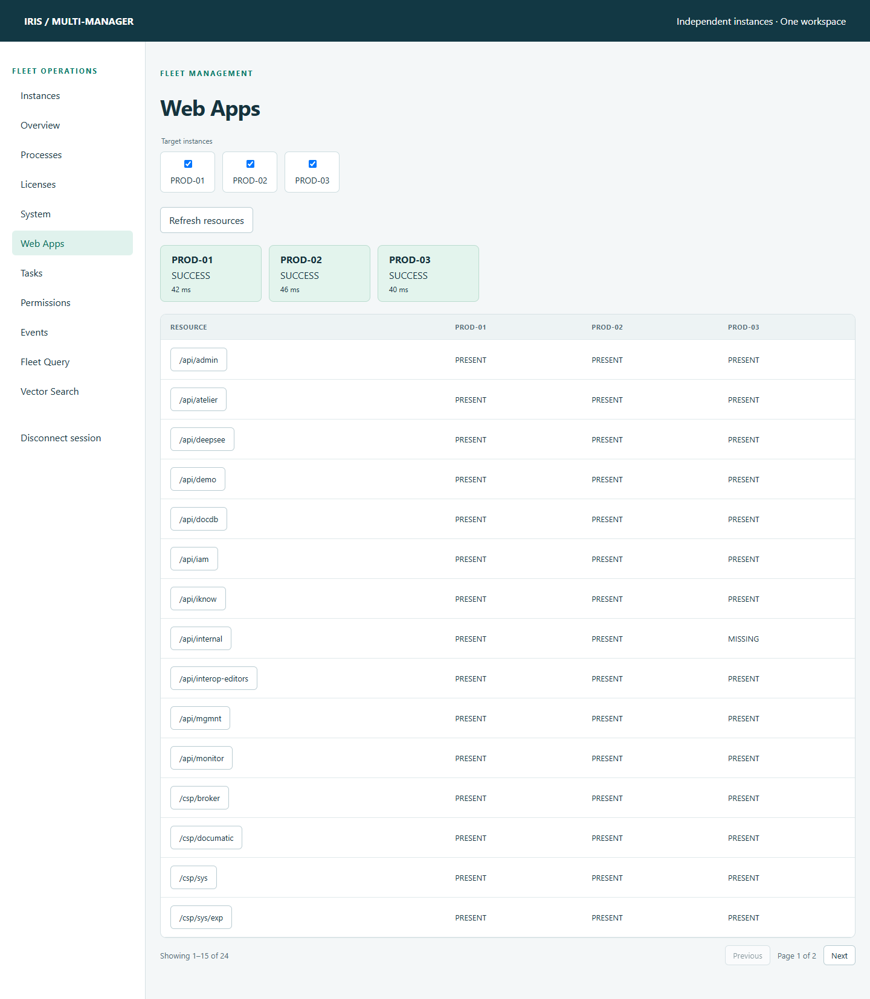

### Tasks

**Tasks** compares scheduled tasks across instances. Select a task to inspect its configuration and preview a `run`, `suspend`, or `resume` request. Run requests are asynchronous; suspend and resume are verified after execution.

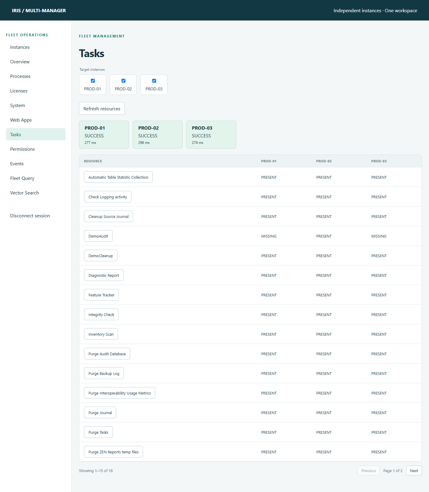

### Permissions

**Permissions** is a read-only comparison workspace. Use the resource-type list to inspect users, roles, resources, wallet collections, X509 credentials, OAuth servers, and OAuth resource servers. Secret values are never sent to the frontend.

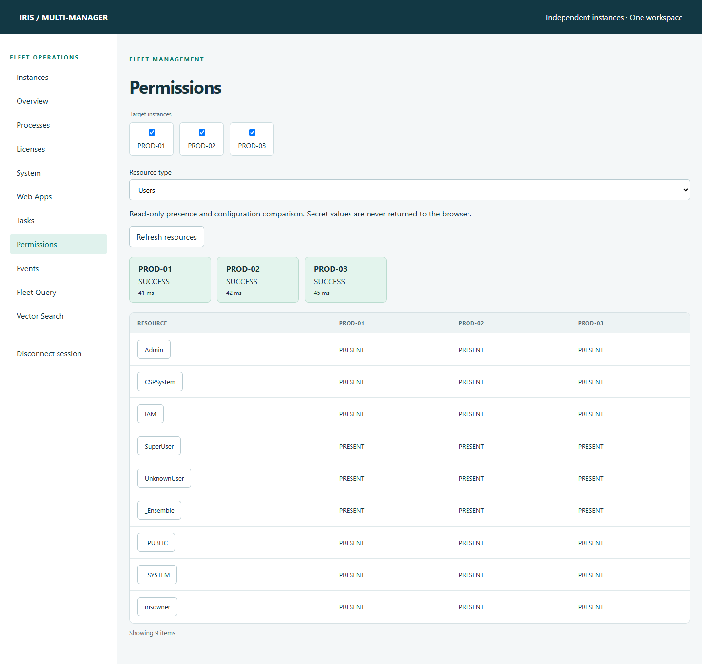

### Events

**Events** retrieves up to 100 audit events per selected instance. Select **Refresh audit events** to request a new snapshot. Results remain separated by server so event origin is always visible.

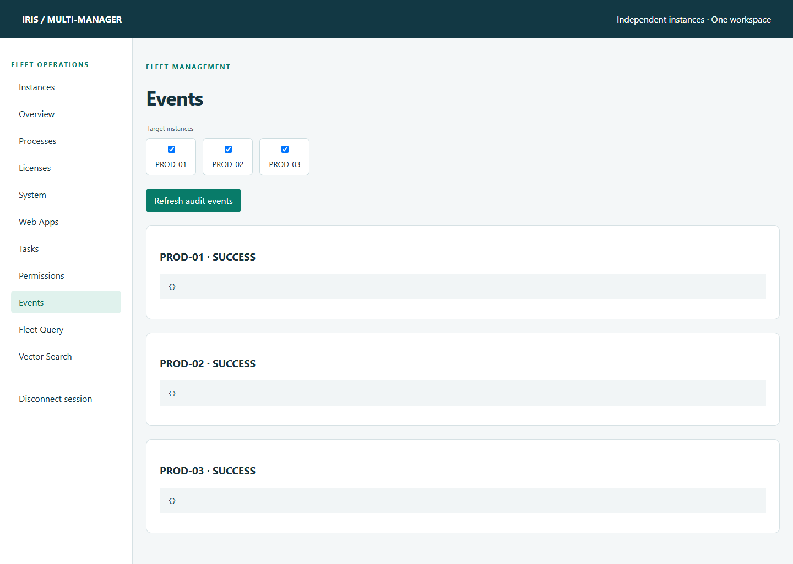

### Fleet Query

**Fleet Query** runs one bounded, read-only `SELECT` statement on each selected server and groups rows by instance.

1. Enter a `SELECT` query.
2. Choose a maximum of 1–500 rows per target.
3. Select **Run SELECT**.

The default demo query is:

```sql
SELECT COUNT(*) FROM MultiManager_Demo.Person
```

Each target has a 15-second timeout. Statements that are not a single read-only `SELECT` are rejected.

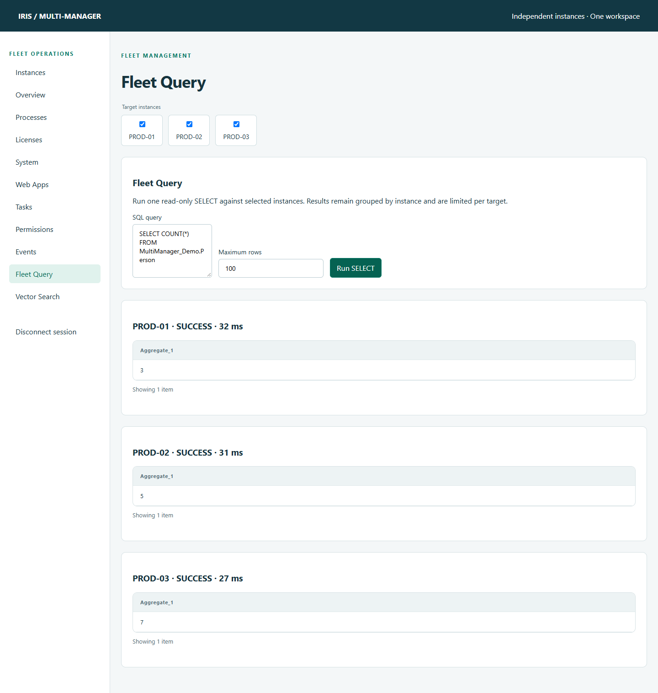

### Vector Search

**Vector Search** discovers `VECTOR` and `EMBEDDING` columns through the IRIS class dictionary. It shows dimensions, row counts, HNSW indexes, embedding configurations, and resolved data/index locations.

- Use **Check selected instances** to test whether a top-level Embedded Python module is discoverable.
- Use **Rows** to preview source data with vector values hidden.
- Use **Vector preview** to explicitly include vector values.
- Use **Regenerate row 1** on the bundled four-dimension demo recipe.
- Preview and confirm HNSW create, rebuild, or drop operations.
- Test the controlled Embedded Python embedding recipe with sample text.

HNSW and regeneration actions use a single-use, session-bound preview token that expires after two minutes. User input is resolved against discovered assets and does not become an unrestricted SQL identifier.

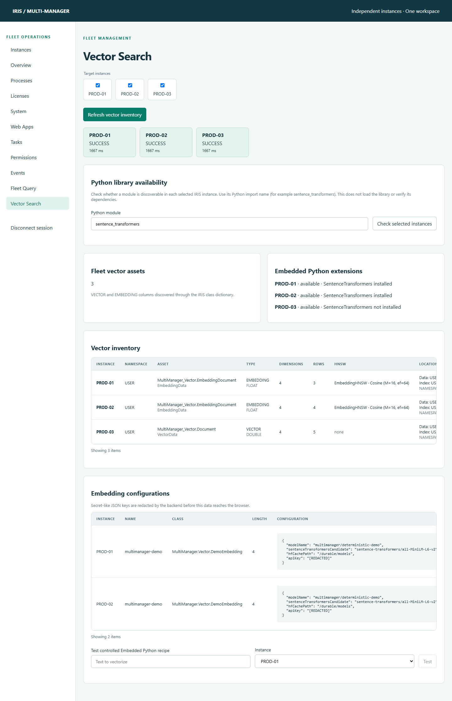

## Connect the fleet to other IRIS servers

The fleet registry is configuration-driven. The current UI does not provide an **Add server** form. Register external servers in [`backend/src/main/resources/application.properties`](backend/src/main/resources/application.properties), rebuild the backend, and then connect from **Instances**.

### Requirements for each external server

- The backend container must be able to resolve and reach the server hostname.
- The IRIS SysAdmin API must be available at an address ending in `/api/admin`.
- The account entered in **Instances** must have the permissions required by the functions you intend to use.
- JDBC must be reachable for Fleet Query and vector features.
- Both the SysAdmin API hostname and `jdbcHost` must appear in `fleet.allowed-hosts`.
- For vector library checks and controlled regeneration, install the current [`MultiManager.Vector.Extension`](docker/iris/src/MultiManager/Vector/Extension.cls) in the target namespace.

### Choose the hostname from the backend container's point of view

| Server location | Hostname to use |
| --- | --- |
| Another service in the same Compose network | Its Compose service name, such as `iris-prod4` |
| IRIS running on the Docker Desktop host | Usually `host.docker.internal` |
| IRIS on another machine | A DNS name or IP address reachable from the backend container |

The browser's ability to open an IRIS portal does not prove that the backend container can reach it. Firewall rules must allow the backend host/container to access the IRIS web and superserver ports.

### Step-by-step configuration

1. Open [`backend/src/main/resources/application.properties`](backend/src/main/resources/application.properties).
2. Add the exact API and JDBC hostnames to `fleet.allowed-hosts`.
3. Append one object to the `fleet.instances` JSON array.
4. Keep the complete `fleet.instances` value on one valid properties line.
5. Rebuild and restart the backend.
6. Refresh Multi-Manager, select the new instance, and connect with an account from that IRIS server.

Example for a fourth server reachable as `iris-prod4`:

```properties
fleet.allowed-hosts=iris-prod1,iris-prod2,iris-prod3,iris-prod4
fleet.instances=[{"id":"prod1","name":"PROD-01","adminBaseUrl":"http://iris-prod1:52773/api/admin","environment":"PRODUCTION DEMO","jdbcHost":"iris-prod1","jdbcPort":1972,"defaultNamespace":"USER","enabled":true},{"id":"prod2","name":"PROD-02","adminBaseUrl":"http://iris-prod2:52773/api/admin","environment":"PRODUCTION DEMO","jdbcHost":"iris-prod2","jdbcPort":1972,"defaultNamespace":"USER","enabled":true},{"id":"prod3","name":"PROD-03","adminBaseUrl":"http://iris-prod3:52773/api/admin","environment":"PRODUCTION DEMO","jdbcHost":"iris-prod3","jdbcPort":1972,"defaultNamespace":"USER","enabled":true},{"id":"prod4","name":"PROD-04","adminBaseUrl":"http://iris-prod4:52773/api/admin","environment":"PRODUCTION","jdbcHost":"iris-prod4","jdbcPort":1972,"defaultNamespace":"USER","enabled":true}]
```

Apply the change:

```bash
docker compose up -d --build backend
docker compose ps backend
```

Refresh [http://localhost:8080](http://localhost:8080). `PROD-04` should now appear in **Target instances**.

For a server running on the Docker Desktop host, the relevant fields would look like this:

```json
{
  "id": "local-iris",
  "name": "LOCAL-IRIS",
  "adminBaseUrl": "http://host.docker.internal:52773/api/admin",
  "environment": "DEVELOPMENT",
  "jdbcHost": "host.docker.internal",
  "jdbcPort": 1972,
  "defaultNamespace": "USER",
  "enabled": true
}
```

On Linux, `host.docker.internal` may need this backend service mapping in `docker-compose.yml`:

```yaml
services:
  backend:
    extra_hosts:
      - "host.docker.internal:host-gateway"
```

Use HTTPS for production connections. If the server uses a private certificate authority, add that CA to the backend container's Java trust store before configuring an `https://` endpoint.

## Configuration reference

### Instance fields

| Field | Purpose | Rules |
| --- | --- | --- |
| `id` | Stable internal identifier | Unique lowercase letters, digits, and hyphens |
| `name` | Label shown in the UI | Use a recognizable server name |
| `adminBaseUrl` | SysAdmin API root | `http` or `https`, exact path `/api/admin`, no query or fragment |
| `environment` | Environment description | For example `PRODUCTION`, `TEST`, or `DEVELOPMENT` |
| `jdbcHost` | Host used by JDBC | Must be included in `fleet.allowed-hosts` |
| `jdbcPort` | IRIS superserver port | Integer from 1 to 65535; commonly `1972` |
| `defaultNamespace` | Default namespace for JDBC operations | Letters, digits, `%`, `_`, and `-` |
| `enabled` | Whether the instance appears in the UI | Set to `false` to hide it after a backend rebuild |

The registry accepts at most 32 configured instances. Host allowlisting is intentional: it prevents browser input from turning the backend into an unrestricted network proxy.

### Query limits

```properties
fleet.query.max-rows=500
fleet.query.timeout-seconds=15
```

These values cap the requested row count and execution time for each selected instance.

## Validation, logs, and shutdown

### Run the live smoke checks

After all containers are healthy, PowerShell users can run:

```powershell
./scripts/smoke.ps1
./scripts/smoke-process.ps1
./scripts/smoke-webapps.ps1
./scripts/smoke-tasks.ps1
./scripts/smoke-security.ps1
./scripts/smoke-secrets.ps1
./scripts/smoke-system-events.ps1
./scripts/smoke-query.ps1
./scripts/smoke-monitor.ps1
./scripts/smoke-vector.ps1
./scripts/smoke-vector-library.ps1
```

The backend unit suite runs during the Docker image build.

### View logs

```bash
docker compose logs -f backend
docker compose logs -f frontend
docker compose logs -f iris-prod1
```

### Stop and restart

Stop the containers while retaining demo data:

```bash
docker compose down
```

Start them again:

```bash
docker compose up -d
```

To intentionally delete all three demo database volumes and recreate the demo from scratch:

```bash
docker compose down --remove-orphans --volumes
docker compose up -d --build
```

The first command permanently removes the demo databases stored in the project's Docker volumes. It is not required for a normal restart.

## Security and operational notes

- The local demo publishes ports only on `127.0.0.1`.
- Credentials are held in the backend session and cleared from the password field after connection.
- API responses use `Cache-Control: no-store` and do not return submitted passwords.
- Secret-like embedding configuration keys such as `apiKey`, `token`, `password`, and `secret` are recursively replaced with `[REDACTED]` before data reaches Angular.
- Process actions verify instance, PID, and start time before execution.
- Web application, task, HNSW, and regeneration changes use preview/confirmation flows.
- Fleet Query accepts a single read-only `SELECT` and applies row and timeout limits.
- Production deployments should add frontend authentication, TLS, appropriate IRIS roles, secret management, network policy, and audit retention for their environment.

## Monitoring data sources

The monitoring screens use fields from the official SysAdmin OpenAPI contract. Missing values remain unavailable; Multi-Manager does not generate replacement metrics.

| UI metric | SysAdmin API | Main OpenAPI fields |
| --- | --- | --- |
| Overview and status | `GET /v2/monitor/dashboard/main` | `SystemUsage`, `Performance`, `Licensing`, `Status` |
| License details | `GET /v2/monitor/license-usage` | `UsageByUser`, `UsageByProcess` |
| Processes | `GET /v2/processes` | `CPUTime`, `ElapsedTime`, process identity fields |
| System counters | `GET /v2/monitor/system-usage` | Global, routine, block, WIJ, and journal counters |
| Shared memory | `GET /v2/monitor/system-usage/shared-memory` | `SMHAllocated`, `SMHUsed`, `SMHAvailable`, `AllUsed` |
